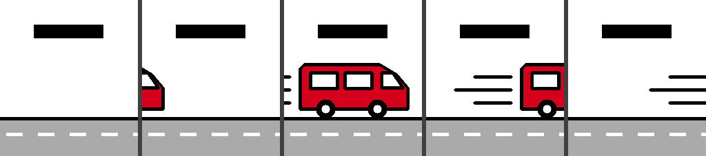

# BCN Bus

Temps d'espera dels autobusos de TMB al canell. App per a Pebble, pensada per
al **Pebble Time 2**, que consulta el servei iBus de Transports Metropolitans
de Barcelona.

Tres maneres d'arribar a una parada, i una sola manera de desar-la:

- **Favorites** — les parades que fas servir cada dia.
- **A prop meu** — busca parades per GPS.
- **Cercar per codi** — tecleja el codi imprès al pal de la parada.

Des de la pantalla d'una parada, **mantén premut el botó central** per desar-la
a favorites o treure-la. Funciona igual hi hagis arribat com hi hagis arribat.

## L'arrencada

En obrir l'app, un autobús travessa la pantalla de banda a banda. Està dibuixat
amb `GPath`, és a dir amb traçats vectorials definits al codi i no amb imatges,
i amb traç gruixut i colors plans com la resta de la interfície del rellotge.
Els traçats s'escalen a l'amplada de la pantalla en carregar, de manera que
omple igual de bé un Basalt de 144 px que un Emery de 200.

Dura poc més d'un segon i **qualsevol botó se la salta**.

## Credencials

L'API de TMB demana credencials pròpies i **no en venen d'incloses**. Registra
una aplicació a [developer.tmb.cat](https://developer.tmb.cat/) i posa
`app_id` i `app_key` a la pantalla de configuració de l'app, des del mòbil. Es
guarden només al telèfon.

## Compilar i instal·lar

Necessites el SDK de Pebble ([developer.repebble.com](https://developer.repebble.com/)),
o bé [CloudPebble](https://cloudpebble.repebble.com/) si prefereixes el navegador.

    pebble build

Després, instal·la-ho **a l'emulador**:

    pebble install --emulator emery

o bé **a un rellotge de veritat**, passant la IP que et mostra l'app de Pebble
del mòbil quan hi actives la *Developer Connection*:

    pebble install --phone <IP del mòbil>

Són dues alternatives del mateix comandament, no dos passos: amb l'emulador no
hi ha cap mòbil ni cap IP pel mig.

## Com està fet

El rellotge no té connexió a internet, així que l'app són dos programes:

    src/c/      codi del rellotge: pantalles, botons, tàctil, favorites
    src/pkjs/   JavaScript que corre al mòbil: crides HTTPS a l'API de TMB

Es parlen per AppMessage. Com que el diccionari d'AppMessage és petit, les
respostes viatgen empaquetades en una sola cadena (`línia|minuts|destí;…`) en
comptes d'una clau per camp.

Les **favorites viuen al rellotge**, que n'és la font de veritat; el mòbil en
guarda una còpia perquè es puguin editar des de la configuració. Per això
desar una parada segueix funcionant amb el mòbil fora de cobertura.

La pantalla de configuració es genera com una URI `data:` i no necessita ni
allotjament ni cap dependència de npm.

### El tàctil

El teclat numèric fa servir el reconeixedor de tocs del SDK
(`tap_recognizer_create`). No s'activa la navegació tàctil del sistema: els
menús es mouen amb els botons, a propòsit.

Quan `touch_service_is_enabled()` diu que no —perquè el rellotge no té tàctil,
o perquè l'has desactivat a *Configuració → Pantalla*— el teclat passa a
botons: amunt i avall canvien la xifra (mantenint-los, gira sola), el central
avança, i mantenir-lo cerca. Als rellotges sense pantalla tàctil el codi del
tàctil ni tan sols es compila.

## Provar els canvis

    ./tools/run-tests.sh

També dibuixa l'animació d'arrencada a `/tmp` executant el codi de debò
contra uns stubs que rasteritzen en comptes de pintar al rellotge, que és com
s'ha ajustat la composició sense tenir cap Pebble a mà.

Comprova el JavaScript del mòbil amb Node, i compila la lògica del rellotge
per a l'ordinador contra uns *stubs* de `pebble.h` per verificar el parsing i
les favorites. També comprova que el codi compila per a totes les plataformes.
No substitueix provar-ho al rellotge, però atrapa el que es pot atrapar sense
maquinari.

## Provar-ho sense rellotge

El SDK porta emulador, i el JavaScript del mòbil corre a la teva màquina, així
que **les crides reals a l'API de TMB funcionen** si hi poses les credencials.

    pebble build
    pebble install --emulator emery

Els botons del rellotge es mapegen al teclat: `Q` enrere, `W` amunt, `S`
central, `X` avall (o les fletxes).

Per posar-hi les credencials, amb **l'app oberta a l'emulador**, executa en una
altra terminal:

    pebble emu-app-config

La pantalla de configuració s'obre al navegador de l'escriptori, no dins de
l'emulador. En desar, torna per una URL local que el simulador de telèfon
recull, i des d'allà les credencials es guarden i les favorites baixen al
rellotge. Si has sortit de l'app i ets a l'esfera, el comandament no trobarà
cap configuració a obrir.

En un rellotge de veritat no cal res d'això: obre l'app de Pebble al mòbil,
busca BCN Bus a la llista i toca l'engranatge.

I per veure què passa per dins, fer una captura, o desencallar l'emulador:

    pebble logs
    pebble screenshot
    pebble kill      # atura emulador i simulador de mòbil
    pebble wipe      # neteja la memòria si es queda penjat

Dues coses que **no** podràs comprovar fins que tinguis el rellotge:

- **El teclat tàctil.** L'emulador no simula tocs, així que el que provaràs és
  el camí de botons. Que és, precisament, el que convé tenir ben provat.
- **La ubicació.** El GPS de l'emulador no és la teva posició real, de manera
  que “A prop meu” pot no retornar res que tingui sentit.

També pots fer servir [CloudPebble](https://cloudpebble.repebble.com/), que
porta l'emulador al navegador sense instal·lar res.

## Coses pendents de verificar

Dues parts s'han escrit sense poder provar-les contra l'API real, i són les
primeres que caldria repassar amb credencials a la mà:

- **El nom del camp del destí del bus.** La documentació de l'API no era
  accessible en escriure això, així que el codi prova diversos noms
  (`destination`, `desti`, `headsign`…) i, si no en troba cap, simplement no
  mostra el destí en comptes de petar. També descarta valors que semblin un
  temps (“3 min”) en lloc d'un destí.
- **Les parades per GPS.** L'endpoint de parades accepta un filtre CQL, però
  no se n'ha pogut confirmar la sintaxi. Es proven dues formes, `DWITHIN` i
  després `BBOX`, i si cap funciona es mostra un error clar.

## Llicència

MIT.
